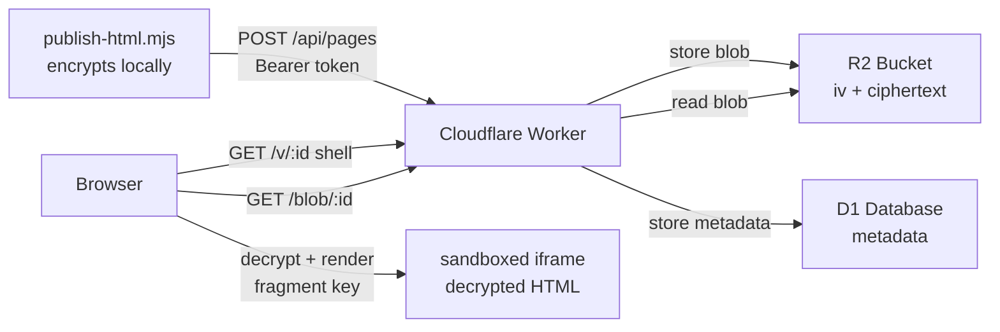

# html-artifact-publisher

A Cloudflare Worker that lets you publish standalone HTML files as shareable, encrypted URLs. The HTML payload is encrypted before upload; the decryption key lives only in the URL fragment, while titles, source names, slugs, timestamps, and hashes remain plaintext metadata.

```
you run  →  encrypt locally  →  upload blob  →  get https://your.domain/v/abc123#<key>
                                                                              ↑
                                          key never leaves the browser ───────┘
```

## Why encrypted by default

Artifacts often contain work-in-progress content, agent outputs, or data you don't want indexed, cached, or visible to the hosting provider. Encrypting before upload means:

- **Payload stays opaque.** R2 stores `iv || AES-256-GCM-ciphertext`. The Worker cannot read the HTML content even if compromised; only uploader-provided metadata remains plaintext.
- **Key is transport-opaque.** URL fragments are not sent to servers in HTTP requests. The key travels only browser-side.
- **No key rotation complexity.** Each artifact gets its own fresh 256-bit key. Revocation is deletion.
- **Share by copy.** The URL *is* the access credential. Shorten the URL and you shorten the key; both become unusable.

The tradeoff: if you lose the URL you lose the key. There is no recovery. That is intentional.

## Architecture



**R2** holds the raw encrypted blobs. Blob format is `iv[12 bytes] || AES-GCM-ciphertext`.

**D1** holds metadata: title, source name, SHA-256 of the ciphertext (integrity), expiry, and a SHA-256 of the delete token. It does not store plaintext HTML content or decryption keys.

**Worker** orchestrates uploads, serves the viewer shell and raw blobs, and runs a cron to delete expired pages every hour.

**Viewer shell** is a thin HTML page with inline JavaScript. It fetches the blob, reads the key from `location.hash`, decrypts with WebCrypto, and renders the result inside a sandboxed `<iframe>`. The server is not involved in decryption.

## Prerequisites

- [Node.js 20+](https://nodejs.org/)
- [Wrangler CLI](https://developers.cloudflare.com/workers/wrangler/install-and-update/) authenticated with your Cloudflare account
- A Cloudflare account with Workers, R2, and D1 enabled

## Quick start

The short path from clone to first published artifact. The [full setup guide](#cloudflare-setup) below has the details.

```bash
# 1. Install
npm install

# 2. Create Cloudflare resources (run once)
wrangler r2 bucket create html-artifact-publisher-pages
wrangler d1 create html-artifact-publisher    # copy the database_id into wrangler.jsonc
wrangler d1 migrations apply html-artifact-publisher

# 3. Set the secret bearer token
wrangler secret put BEARER_TOKEN              # paste a strong random token when prompted

# 4. Deploy
npm run deploy

# 5. Publish your first artifact
export HTML_PUBLISHER_URL=https://<your-worker-domain>
export HTML_PUBLISHER_TOKEN=<your-bearer-token>
node scripts/publish-html.mjs --title "My first artifact" my-page.html
# → prints viewerUrl with #fragment key and copies it to clipboard
```

The `viewerUrl` is the complete share link. Send it to anyone — no account, no login, no server-side decryption required to view it.

## Cloudflare setup

All commands run from the repo root. Replace placeholders like `<your-domain>` with your actual values.

### 1. Install dependencies

```bash
npm install
```

### 2. Create the R2 bucket

```bash
wrangler r2 bucket create html-artifact-publisher-pages
# For local dev preview (optional):
wrangler r2 bucket create html-artifact-publisher-pages-dev
```

### 3. Create the D1 database

```bash
wrangler d1 create html-artifact-publisher
```

Copy the `database_id` from the output and update `wrangler.jsonc`:

```jsonc
"d1_databases": [
  {
    "binding": "DB",
    "database_name": "html-artifact-publisher",
    "database_id": "<paste-your-database-id-here>",
    "migrations_dir": "migrations"
  }
]
```

### 4. Update the public base URL

In `wrangler.jsonc`, set `PUBLIC_BASE_URL` to your Worker's domain:

```jsonc
"vars": {
  "PUBLIC_BASE_URL": "https://<your-domain>"
}
```

Also update the `routes` block if you are using a custom domain:

```jsonc
"routes": [
  { "pattern": "<your-domain>", "custom_domain": true }
]
```

### 5. Run database migrations

```bash
# Remote (production):
wrangler d1 migrations apply html-artifact-publisher

# Local dev only:
wrangler d1 migrations apply html-artifact-publisher --local
```

### 6. Set the bearer token secret

Generate a strong token (e.g. `openssl rand -hex 32`) and set it as a Worker secret:

```bash
wrangler secret put BEARER_TOKEN
# Paste your token when prompted. It is stored encrypted in Cloudflare — never in wrangler.jsonc.
```

### 7. Deploy

```bash
npm run deploy
```

Confirm the deployment with:

```bash
curl https://<your-domain>/healthz
# → {"status":"ok","ts":...}
```

## Local development

Copy the example env file and set a local token:

```bash
cp .dev.vars.example .dev.vars
# Edit .dev.vars: set BEARER_TOKEN to any local test value
```

Start the dev server (uses local R2 and D1 by default via Wrangler's local miniflare runtime):

```bash
npm run dev
```

The Worker runs at `http://localhost:8787`. Point `HTML_PUBLISHER_URL` at it for local publishing:

```bash
HTML_PUBLISHER_URL=http://localhost:8787 \
HTML_PUBLISHER_TOKEN=your-local-token \
  node scripts/publish-html.mjs my-artifact.html
```

## CLI usage

```bash
node scripts/publish-html.mjs [options] <file.html>
```

**Options:**

| Flag | Description | Default |
|------|-------------|---------|
| `--title <text>` | Display title | filename |
| `--ttl <duration>` | `1h`, `6h`, `24h`, `7d`, `30d`, `never` | `7d` |
| `--slug <slug>` | Vanity slug `[a-z0-9-]{1,64}` — appears in URL instead of random ID | — |
| `--delete-local` | Delete the local HTML file after confirmed upload | off |
| `--json` | Machine-readable JSON on stdout; no human output | off |
| `--copy` | Copy viewerUrl to clipboard even when `--json` is set | off |
| `--no-clipboard` | Suppress clipboard in any mode | off |

**Required environment variables:**

```bash
export HTML_PUBLISHER_URL=https://<your-domain>
export HTML_PUBLISHER_TOKEN=<your-bearer-token>
```

### Examples

```bash
# Basic publish — prints result + copies URL to clipboard
node scripts/publish-html.mjs report.html

# With a title, 30-day TTL, and vanity slug
node scripts/publish-html.mjs --title "Q2 Results" --ttl 30d --slug q2-results report.html

# Never expires
node scripts/publish-html.mjs --ttl never permanent.html

# Clean up the local file once it's safely uploaded
node scripts/publish-html.mjs --delete-local artifact.html

# Machine-readable JSON for piping into other tools
node scripts/publish-html.mjs --json artifact.html | jq .viewerUrl

# JSON but also copy to clipboard (URL on stderr note, JSON clean on stdout)
node scripts/publish-html.mjs --json --copy artifact.html
```

### Human output

```
{
  "id": "abc123XYZ_def",
  "viewerUrl": "https://your.domain/v/abc123XYZ_def#<base64url-key>",
  "blobUrl":   "https://your.domain/blob/abc123XYZ_def",
  "expiresAt": "2026-07-31T00:00:00.000Z",
  "deleteToken": "deadbeef...",
  "warnings": 0,
  "warningMessages": []
}

Published: https://your.domain/v/abc123XYZ_def#<base64url-key>
   Expires:   7/31/2026, 12:00:00 AM
   Copied to clipboard
```

### JSON output (`--json`)

```json
{
  "id": "abc123XYZ_def",
  "viewerUrl": "https://your.domain/v/abc123XYZ_def#<base64url-key>",
  "blobUrl": "https://your.domain/blob/abc123XYZ_def",
  "expiresAt": "2026-07-31T00:00:00.000Z",
  "deleteToken": "deadbeef...",
  "warnings": 0,
  "warningMessages": []
}
```

Clipboard behavior by mode:

| Mode | Clipboard |
|------|-----------|
| Human (default) | Best-effort copy of `viewerUrl`; prints `Copied to clipboard` or `Clipboard unavailable` |
| `--json` | Silent, no clipboard |
| `--json --copy` | Best-effort copy; `# clipboard: copied` or `# clipboard: unavailable` on stderr; stdout stays clean JSON |
| `--no-clipboard` | Clipboard suppressed in all modes |

Clipboard uses `pbcopy` on macOS, `clip` on Windows, and tries `wl-copy` → `xclip` → `xsel` on Linux. Failure is non-fatal.

> **The `#fragment` is the key.** If you strip the fragment from the URL the artifact becomes permanently unreadable. Do not log, shorten, or proxy the URL in ways that drop the fragment.

### External URL warnings

If your HTML references `http://` or `https://` URLs, the script prints a warning:

```
Warning: 3 external reference(s) detected.
  Warning: external URL: https://cdn.example.com/style.css
  ...
  Artifact may not render offline and could leak referrer information.
```

This is advisory, not blocking. A fully self-contained artifact (inlined CSS, JS, and images) is always preferable.

## Deleting an artifact

Use the `deleteToken` from the upload response:

```bash
curl -X DELETE https://<your-domain>/api/pages/<id> \
  -H "X-Delete-Token: <deleteToken>"
```

Or use the bearer token (useful for admin cleanup):

```bash
curl -X DELETE https://<your-domain>/api/pages/<id> \
  -H "Authorization: Bearer <your-bearer-token>"
```

## Listing artifacts

```bash
curl https://<your-domain>/api/pages \
  -H "Authorization: Bearer <your-bearer-token>"
```

Returns `{ "pages": [...] }` with page records sorted newest-first. Titles and source names are plaintext (provided by the uploader at publish time). No HTML content is exposed.

## Size limits and TTL

| Setting | Default | Configurable via |
|---------|---------|-----------------|
| Max payload | 10 MB | `MAX_PAYLOAD_BYTES` in `wrangler.jsonc` vars |
| Default TTL | 7 days | `DEFAULT_TTL_SECONDS` in `wrangler.jsonc` vars |
| Max TTL | 30 days | `MAX_TTL_SECONDS` in `wrangler.jsonc` vars |
| No expiry | pass `--ttl never` | — |

The 10 MB limit applies to the encrypted ciphertext. The original HTML is slightly smaller (AES-GCM adds a 16-byte authentication tag). In practice R2 can hold files much larger; the limit exists to control egress costs and Worker memory.

## Safety model

| Property | How |
|----------|-----|
| Server-side confidentiality | R2 stores only `iv \|\| ciphertext` for the HTML body. D1 stores plaintext metadata: title, source name, slug, timestamps, size, and SHA-256 of ciphertext/delete token. |
| Key isolation | The 256-bit AES key is generated on the client, appended to the URL as a `#fragment`, and never transmitted to the server in any HTTP request. |
| Integrity | SHA-256 of the ciphertext is verified by the Worker before storing. The viewer verifies AES-GCM authentication tag on decrypt. |
| Token security | Bearer token and delete token comparisons use timing-safe equality. Delete tokens are stored as SHA-256 hashes. |
| Viewer sandboxing | Decrypted HTML renders inside `<iframe sandbox="allow-scripts allow-forms allow-modals allow-popups" referrerpolicy="no-referrer">`. The iframe cannot access parent-document cookies, local storage, or same-origin APIs. |
| CSP | Viewer shell uses script and style nonces. Artifacts get the same nonce injected. |
| No indexing | All responses carry `X-Robots-Tag: noindex, nofollow` and `Referrer-Policy: no-referrer`. |

**What this does not protect against:** anyone with the full URL (including fragment) can view the artifact. The key is only as secret as the URL. Use expiry (`--ttl`) for anything time-sensitive.

## Scheduled cleanup

A Cloudflare cron runs every hour (`0 * * * *`). It queries D1 for expired pages, deletes the R2 blobs in parallel batches of 100, then removes the D1 rows. No action needed on your part.

To trigger cleanup manually during development:

```bash
curl -X POST "http://localhost:8787/__scheduled?cron=0+*+*+*+*"
```

## CI

The repo ships a minimal GitHub Actions workflow (`.github/workflows/ci.yml`) that installs dependencies, regenerates Wrangler types, and runs a TypeScript no-emit check:

```bash
npm run types      # wrangler types --env-file .dev.vars.example
npm run typecheck  # tsc --noEmit
```

No Cloudflare credentials are required — `wrangler types` reads from `wrangler.jsonc` and the example env file.

## Repo layout

```
.
├── .github/
│   └── workflows/
│       └── ci.yml                CI: install, wrangler types, tsc --noEmit
├── src/
│   └── index.ts                  Cloudflare Worker (routes, upload, viewer, cleanup)
├── scripts/
│   └── publish-html.mjs          CLI publisher (Node 20+, no build step)
├── migrations/
│   └── 0001_pages.sql            D1 schema (pages table + indexes)
├── skills/
│   └── publish-html-page/
│       └── SKILL.md              OMP / Oh My Pi skill definition
├── agent-harnesses/              Copy-paste fragments for other harnesses
│   ├── agents-md-fragment.md     Codex / AGENTS.md
│   ├── claude-md-fragment.md     CLAUDE.md injection
│   ├── cursor-rule.mdc           Cursor (.cursor/rules/ or .cursorrules)
│   ├── windsurf-rule.md          Windsurf (.windsurf/rules/)
│   └── system-prompt-fragment.md Generic system-prompt / instructions
├── docs/
│   └── agent-harnesses.md        Harness install guide
├── worker-configuration.d.ts     Generated Wrangler types (committed)
├── wrangler.jsonc                 Worker config (bindings, routes, vars, crons)
├── tsconfig.json
├── package.json
└── .dev.vars.example             Local dev env template (no real secrets)
```

## Agent harness integration

See [`docs/agent-harnesses.md`](docs/agent-harnesses.md) for copy-paste instructions covering OMP skills, Claude Code skills, project-local skills, Codex / AGENTS.md, Cursor rules, Windsurf rules, and generic system-prompt fragments.
